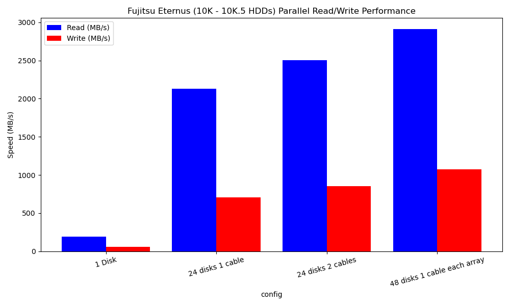
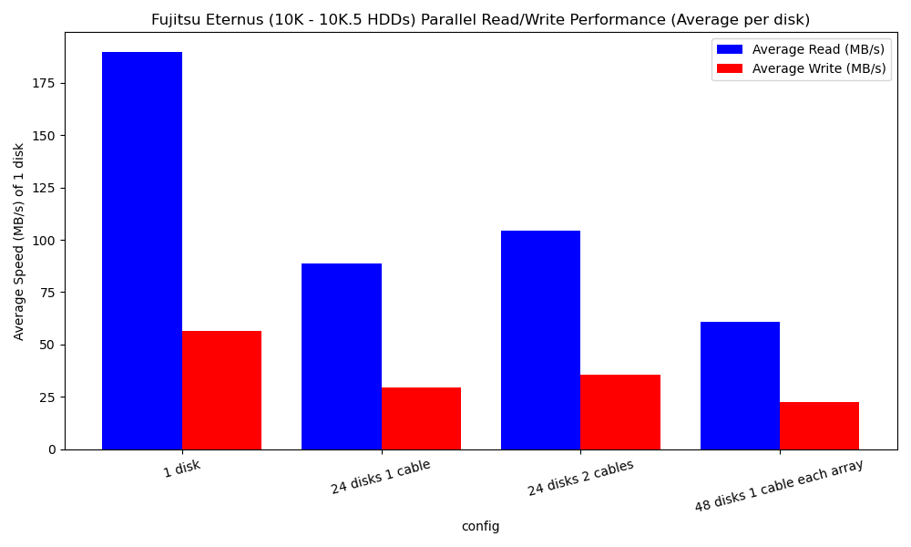

# Dell 7190 & Fujitsu Eternus benchmarks

Tested on Linux 6.11.0-8-generic kernel.

## CPU

### Passmark Test

```
                   PassMark PerformanceTest Linux (11.0.1002)


Intel Xeon CPU E5-2699 v3 @ 2.30GHz (x86_64)
36 cores @ 3600 MHz  |  251.8 GiB RAM
Number of Processes: 72  |  Test Iterations: 1  |  Test Duration: Medium
--------------------------------------------------------------------------------
CPU Mark:                          40113
  Integer Math                     183689 Million Operations/s
  Floating Point Math              92790 Million Operations/s
  Prime Numbers                    229 Million Primes/s
  Sorting                          107511 Thousand Strings/s
  Encryption                       17111 MB/s
  Compression                      732791 KB/s
  CPU Single Threaded              2182 Million Operations/s
  Physics                          2553 Frames/s
  Extended Instructions (SSE)      38285 Million Matrices/s

Memory Mark:                       2517
  Database Operations              19231 Thousand Operations/s
  Memory Read Cached               23370 MB/s
  Memory Read Uncached             8968 MB/s
  Memory Write                     9011 MB/s
  Available RAM                    248669 Megabytes
  Memory Latency                   53 Nanoseconds
  Memory Threaded                  111866 MB/s
--------------------------------------------------------------------------------
```

### linux-6.14-rc5 build

```
real    1m23.036s
user    63m4.060s
sys     6m6.023s
```

## FreeBSD 14.1-RELEASE GENERIC kernel build

```
       77.90 real      4134.99 user       290.47 sys
--------------------------------------------------------------
>>> Kernel build for GENERIC completed on Thu Mar 20 17:51:05 CET 2025
--------------------------------------------------------------
>>> Kernel(s)  GENERIC built in 78 seconds, ncpu: 72, make -j72
--------------------------------------------------------------
```


## Disks

These are maximum throughput tests. All disks read/written 1GiB in parallel
(no RAID, no filesystem, literal maximal physically possible parallel throughput
on raw devices).

### Internal AHCI controllers - 7K.2 HDDs

```
read test for n: 8
time:         10.98 seconds
data total:   8 GiB = 8192.00 MiB = 8589.93 MB
data each:    1 GiB = 1024.00 MiB = 1073.74 MB
speed total:  746.39 MiB/s = 782.65 MB/s
speed avg:    93.30 MiB/s = 97.83 MB/s

write test for n: 8
time:         73.33 seconds
data total:   8 GiB = 8192.00 MiB = 8589.93 MB
data each:    1 GiB = 1024.00 MiB = 1073.74 MB
speed total:  111.71 MiB/s = 117.14 MB/s
speed avg:    13.96 MiB/s = 14.64 MB/s
```

### SAS HBA controller (Dell H200e) <-> Fujitsu Eternus (10K - 10K.5 SAS HDDs)

#### Graphs - 1st total, 2nd avg per disk (below more detailed)






##### 1 disk

```
--- 1 disk ----------------------------------------
read test for n: 1
time:         5.66 seconds
data total:   1 GiB = 1024.00 MiB = 1073.74 MB
data each:    1 GiB = 1024.00 MiB = 1073.74 MB
speed total:  180.93 MiB/s = 189.72 MB/s
speed avg:    180.93 MiB/s = 189.72 MB/s

write test for n: 1
time:         19.00 seconds
data total:   1 GiB = 1024.00 MiB = 1073.74 MB
data each:    1 GiB = 1024.00 MiB = 1073.74 MB
speed total:  53.90 MiB/s = 56.52 MB/s
speed avg:    53.90 MiB/s = 56.52 MB/s
---------------------------------------------------
```

##### 24 disks on 1 Eternus via 1 cable

```
--- 24 disks 1 cable ------------------------------
read test for n: 24
time:         12.09 seconds
data total:   24 GiB = 24576.00 MiB = 25769.80 MB
data each:    1 GiB = 1024.00 MiB = 1073.74 MB
speed total:  2032.88 MiB/s = 2131.63 MB/s
speed avg:    84.70 MiB/s = 88.82 MB/s

write test for n: 24
time:         36.34 seconds
data total:   24 GiB = 24576.00 MiB = 25769.80 MB
data each:    1 GiB = 1024.00 MiB = 1073.74 MB
speed total:  676.33 MiB/s = 709.18 MB/s
speed avg:    28.18 MiB/s = 29.55 MB/s
---------------------------------------------------
```

##### 24 disks on 1 Eternus via 2 cables

```
--- 24 disks 2 cables -----------------------------
read test for n: 24
time:         10.29 seconds
data total:   24 GiB = 24576.00 MiB = 25769.80 MB
data each:    1 GiB = 1024.00 MiB = 1073.74 MB
speed total:  2388.44 MiB/s = 2504.46 MB/s
speed avg:    99.52 MiB/s = 104.35 MB/s

write test for n: 24
time:         30.32 seconds
data total:   24 GiB = 24576.00 MiB = 25769.80 MB
data each:    1 GiB = 1024.00 MiB = 1073.74 MB
speed total:  810.62 MiB/s = 850.00 MB/s
speed avg:    33.78 MiB/s = 35.42 MB/s
---------------------------------------------------
```

##### 48 disks on 2x Eternus' via 1 cable each

```
--- 48 disks 1 cable each array -------------------
read test for n: 48
time:         17.70 seconds
data total:   48 GiB = 49152.00 MiB = 51539.61 MB
data each:    1 GiB = 1024.00 MiB = 1073.74 MB
speed total:  2776.32 MiB/s = 2911.19 MB/s
speed avg:    57.84 MiB/s = 60.65 MB/s

write test for n: 48
time:         48.12 seconds
data total:   48 GiB = 49152.00 MiB = 51539.61 MB
data each:    1 GiB = 1024.00 MiB = 1073.74 MB
speed total:  1021.46 MiB/s = 1071.08 MB/s
speed avg:    21.28 MiB/s = 22.31 MB/s
---------------------------------------------------
```
